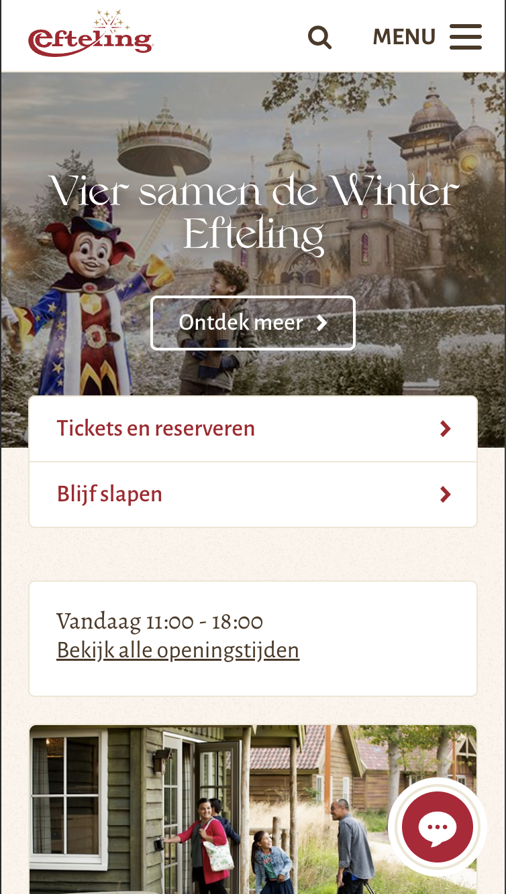
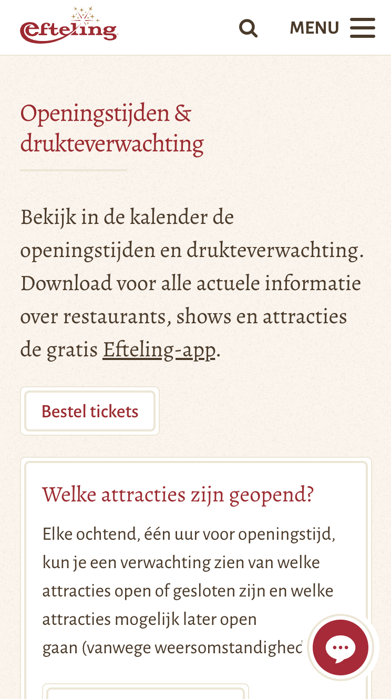
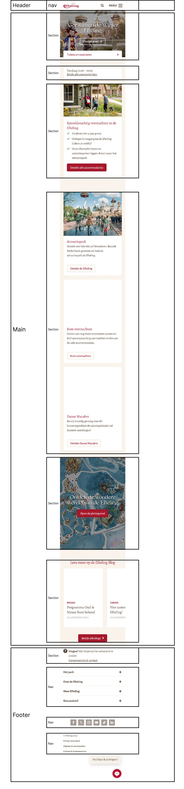
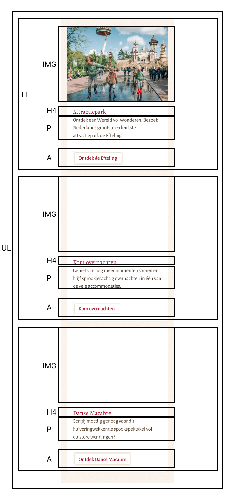
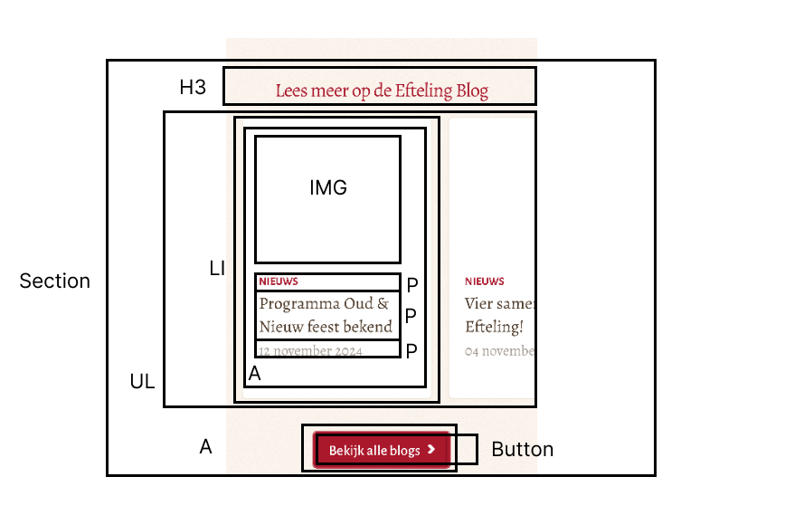

# Procesverslag
Markdown is een simpele manier om HTML te schrijven.  
Markdown cheat cheet: [Hulp bij het schrijven van Markdown](https://github.com/adam-p/markdown-here/wiki/Markdown-Cheatsheet).

Nb. De standaardstructuur en de spartaanse opmaak van de README.md zijn helemaal prima. Het gaat om de inhoud van je procesverslag. Besteedt de tijd voor pracht en praal aan je website.

Nb. Door *open* toe te voegen aan een *details* element kun je deze standaard open zetten. Fijn om dat steeds voor de relevante stuk(ken) te doen.


## Jij ✅

<details>
  <summary>uitwerken voor kick-off werkgroep</summary>

  ### Auteur:
  Levi Titarsole

  #### Je startniveau:
  Mijn start niveau voor dit project is ```Rood``` Dit omdat wel ervaring heb met code maar me nog zeker geen expert noem.

  #### Je focus:
  De focus die ik leg dit vak gaat worden op  ```Responsive``` Dit omdat ik het gevoel heb dat ik hier nog het meeste in kan leren
  
 
</details>


## Je website ✅

<details>
  <summary>uitwerken voor kick-off werkgroep</summary>

  ### Je opdracht:
  https://www.efteling.com/nl

  #### Screenshot(s) van de eerste pagina (small screen): 
  Home Pagina Efteling  
  

  #### Screenshot(s) van de tweede pagina (small screen):
  Openingstijden pagina Efteling  
  
 
</details>


## Toegankelijkheidstest 1/2 (week 1) ✅

<details>
  <summary>uitwerken na test in 2<sup>e</sup> werkgroep</summary>

  ### Bevindingen
  Lijst met je bevindingen die in de WCAG test naar voren kwamen:
* Op het moment van checken van de website waren sommige knoppen niet werkend wanneer de website naar de mobile versie ging.
* De website maakten bijna alleen maar gebruik van div's en de tekst was niet 100% samantisch
* De website was goed te navigeren aan de hand van tabs.
* Buiten de knop die niet werkte op de home page werkte alles perfect voor mobile.
* De website maakt gebruik van zeer uitgebreide alt teksten.
* Alle video's binnen in de website stonden op autoplay en konden niet worden gepauzeert.
* Binnen in de website word geen dark-mode gesupport 

</details>


## Breakdownschets (week 1) ✅

<details>
  <summary>uitwerken na afloop 3<sup>e</sup> werkgroep</summary>

  ### de hele pagina: 
  

  ### dynamisch deel (bijv menu): 
  

  ### wellicht nog een dynamisch deel (bijv filter): 
  

</details>


## Voortgang 1 (week 2)

<details open>
  <summary>uitwerken voor 1<sup>e</sup> voortgang</summary>

  ### Stand van zaken
  hier dit ging goed & dit was lastig (neem ook screenshots op van delen van je website en code)


  ### Agenda voor meeting
  samen met je groepje opstellen

  | student 1      | student 2          | student 3    | student 4        |
  | ---            | ---                | ---          | ---              |
  | dit bespreken  | en dit             | en ik dit    | en dan ik dat    |
  | en dat ook nog | dit als er tijd is | nog een punt | dit wil ik zeker |
  | ...            | ...                | ...          | ...              |


  ### Verslag van meeting
  hier na afloop snel de uitkomsten van de meeting vastleggen

  - punt 1
  - punt 2
  - nog een punt
  - ...

</details>


## Voortgang 2 (week 3)

<details>
  <summary>uitwerken voor 2<sup>e</sup> voortgang</summary>

  ### Stand van zaken
  hier dit ging goed & dit was lastig (neem ook screenshots op van delen van je website en code)


  ### Agenda voor meeting
  samen met je groepje opstellen

  | student 1      | student 2          | student 3    | student 4        |
  | ---            | ---                | ---          | ---              |
  | dit bespreken  | en dit             | en ik dit    | en dan ik dat    |
  | en dat ook nog | dit als er tijd is | nog een punt | dit wil ik zeker |
  | ...            | ...                | ...          | ...              |


  ### Verslag van meeting
  hier na afloop snel de uitkomsten van de meeting vastleggen

  - punt 1
  - punt 2
  - nog een punt
- ...

</details>


## Toegankelijkheidstest 2/2 (week 4)

<details>
  <summary>uitwerken na test in 9<sup>e</sup> werkgroep</summary>

  ### Bevindingen
  Lijst met je bevindingen die in de test naar voren kwamen (geef ook aan wat er verbeterd is):

</details>


## Voortgang 3 (week 4)

<details>
  <summary>uitwerken voor 3<sup>e</sup> voortgang</summary>

  ### Stand van zaken
  hier dit ging goed & dit was lastig (neem ook screenshots op van delen van je website en code)


  ### Agenda voor meeting
  samen met je groepje opstellen

  | student 1      | student 2          | student 3    | student 4        |
  | ---            | ---                | ---          | ---              |
  | dit bespreken  | en dit             | en ik dit    | en dan ik dat    |
  | en dat ook nog | dit als er tijd is | nog een punt | dit wil ik zeker |
  | ...            | ...                | ...          | ...              |


  ### Verslag van meeting
  hier na afloop snel de uitkomsten van de meeting vastleggen

  - punt 1
  - punt 2
  - nog een punt
  - ...

</details>


## Eindgesprek (week 5)

<details>
  <summary>uitwerken voor eindgesprek</summary>

  ### Je uitkomst - karakteristiek screenshots:
  


  ### Dit ging goed/Heb ik geleerd: 
  Korte omschrijving met plaatjes

  


  ### Dit was lastig/Is niet gelukt:
  Korte omschrijving met plaatjes

  
</details>


## Bronnenlijst

<details open>
  <summary>continu bijhouden terwijl je werkt</summary>

  Nb. Wees specifiek ('css-tricks' als bron is bijv. niet specifiek genoeg). 
  Nb. ChatGpT en andere AI horen er ook bij.
  Nb. Vermeld de bronnen ook in je code.

  1. bron 1
  2. bron 2
  3. ...

</details>
